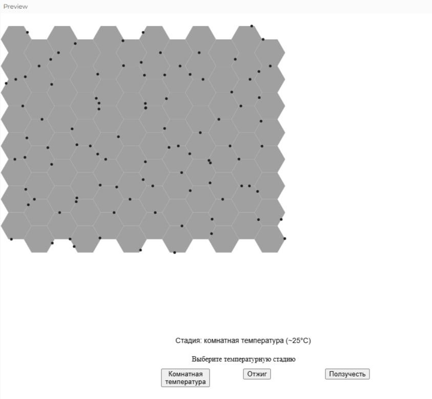
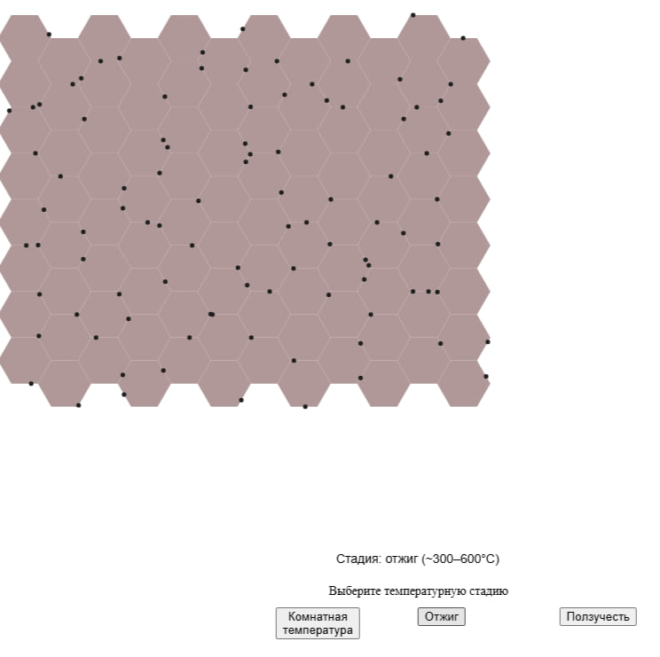
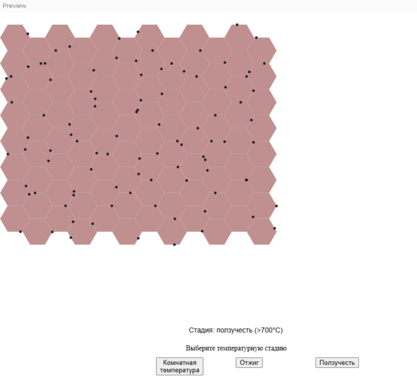

#  Grain Boundary Diffusion Simulation

Interactive simulation of **atomic diffusion along grain boundaries** in solid materials using the p5.js library.

 **Goal**: To visualize how atom diffusion behavior changes under three thermal stages: Room Temperature, Annealing, and Creep, using a simple and intuitive hexagonal grain grid.

---

##  Scientific Background: Grain Boundary Diffusion

In materials science, atoms diffuse faster along grain boundaries than within grains. This process becomes more intense as temperature increases. The simulation demonstrates this with three thermal stages:

- **Room Temperature (~25°C):** Slow diffusion, minimal movement of atoms.
- **Annealing (~300–600°C):** Moderate diffusion, atoms begin to migrate visibly.
- **Creep (>700°C):** Rapid diffusion, atoms flow quickly along grain edges.

---

##  Technologies Used

- **Language**: JavaScript
- **Library**: [p5.js](https://p5js.org/)
- **Editor**: Visual Studio Code
- **Hosting**: GitHub Pages

---

##  Visual Demo

- **Room Temperature**
  
  

- **Annealing**

  

- **Creep**

  

---

##  How to Use

- Click any of the three buttons to choose a thermal stage.
- Watch how the atoms move and how grain color intensifies with heat.

---

##  Running the Project

1. Clone the repo or download the files.
2. Open `index.html` in your browser (recommended via **Live Server**).
3. Or check it live on GitHub Pages *(after enabling it)*.

---

##  License

This project is open-source and provided for academic and educational purposes.
